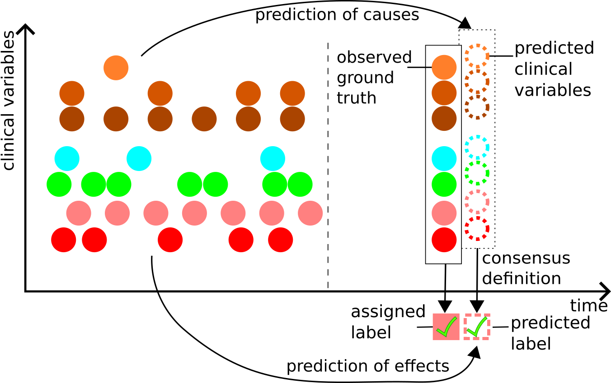

# Early Prediction of Causes (not Effects) in Healthcare by Long-Term Clinical Time Series Forecasting

This is the repository for the paper "Early Prediction of Causes (not Effects) in Healthcare by Long-Term Clinical Time Series Forecasting" accepted at MLHC 2024.

Paper:  LINK to be done

## Table of Contents
- [Early Prediction of Causes (not Effects) in Healthcare by Long-Term Clinical Time Series Forecasting](#early-prediction-of-causes-not-effects-in-healthcare-by-long-term-clinical-time-series-forecasting)
  - [Table of Contents](#table-of-contents)
  - [Abstract](#abstract)
  - [Important Remarks](#important-remarks)
  - [Conda Environment Setup](#conda-environment-setup)
  - [Data Preprocessing](#data-preprocessing)
  - [Model Training](#model-training)
    - [Additional Experiment](#additional-experiment)
  - [Model Evaluation](#model-evaluation)
  - [Citation](#citation)

## Abstract

Machine learning for early syndrome diagnosis aims to solve the intricate task of predicting a ground truth label that most often is the outcome (effect) of a medical consensus definition applied to observed clinical measurements (causes), given clinical measurements observed several hours before.  

Instead of focusing on the prediction of the future effect, we propose to directly predict the causes via time series forecasting (TSF) of clinical variables and determine the effect by applying the gold standard consensus definition to the forecasted values.

This method has the invaluable advantage of being straightforwardly  interpretable to clinical practitioners, and because model training does not rely on a particular label anymore, the forecasted data can be used to predict any consensus-based label. 

We exemplify our method by means of long-term TSF with Transformer models, with a focus on accurate prediction of sparse clinical variables involved in the SOFA-based Sepsis-3 definition and the new Simplified Acute Physiology Score (SAPS-II) definition.

Our experiments are conducted on two datasets and show that contrary to recent proposals which advocate set function encoders for time series and direct multi-step decoders, best results are achieved by a combination of standard dense encoders with iterative multi-step decoders.

The key for success of iterative multi-step decoding can be attributed to its ability to capture cross-variate dependencies and to a student forcing training strategy that teaches the model to rely on its own previous time step predictions for the next time step prediction.




## Important Remarks

To create this repository, we used code from [github.com/sindhura97/STraTS/](https://github.com/sindhura97/STraTS/) and [github.com/cure-lab/LTSF-Linear](https://github.com/cure-lab/LTSF-Linear).

However, the [STraTS code](https://github.com/yiRMT/STraTS) got a major update between submission and acceptance of this paper. Whereas before it contained the code for STraTS in the framework Keras , it now contains a PyTorch implementation.
In our work, we performed our own conversion of the STraTS code to PyTorch.

## Conda Environment Setup

In theory, the following should be enough to reproduce our environments:

```sh
conda create --name strats_pytorch --file env.txt
conda activate strats_pytorch
pip install -r requirements.txt
```

## Data Preprocessing

To use this repository, you need access to the [MIMIC-III (Johnson et al., 2016)](https://physionet.org/content/mimiciii/1.4/) and [eICU (Pollard et al., 2019)](https://physionet.org/content/eicu-crd/2.0/) datasets.

For MIMIC-III, you need to run the following preprocessing scripts in the mimic_experiments folder:

```sh
mimic3_01_preprocess_icu.py
mimic3_02_preprocess_pickle.py
mimic3_03_susinf.py
```

For eICU, you need to run the following preprocessing scripts in the eicu_experiments folder:

```
eicu_01_preprocessing.ipynb
eicu_02_pickle2triplet.py
eicu_03_pickle2dense.py
eicu_04_susinf.py
```


## Model Training

To train the models on the preprocessing MIMIC-III data, please run the following jupyter notebooks in the mimic_experiments folder:

```
sparse_train.ipynb
dense_train.ipynb
```

For eICU, run all models in eicu_experiments/model_files/

### Additional Experiment

To reproduce our direct forecast of sepsis model, run

```
mimic_experiments/mimic_dense_regression.ipynb
eicu_experiments/eicu_dense_regression.py
```


## Model Evaluation

To evaluate our models, run the following Jupyter notebooks for MIMIC-III in the mimic_experiments folder:

```
mimic_eval_sample.ipynb  # calculates MSE scores on the complete test data
mimic_eval_sepsis.ipynb  # calculates Sepsis scores on the filtered test data
mimic_eval_sapsii.ipynb  # calculates SAPS-II scores on the complete test data

Additional Experiment Analysis:
mimic_regression_eval_mse.ipynb    # MSE for the complete test data
mimic_regression_eval_sepsis.ipynb # Sepsis for the filtered test data
```


And the following ones for eICU in the eicu_experiments folder:

```
eicu_eval_sample.ipynb
eicu_eval_sapsii.ipynb
eicu_eval_sepsis.ipynb

Additional Experiment Analysis:
eicu_regression_eval_sepsis.ipynb
eicu_regression_eval_mse.ipynb
```

## Citation
When using this paper or code, please use:

```
@article{staniekETAL24causes,
  title={Early Prediction of Causes (not Effects) in Healthcare by Long-Term Clinical Time Series Forecasting},
  author={Staniek, Michael and Fracarolli, Marius and Hagmann, Michael and Riezler, Stefan},
  journal={Proceedings of Machine Learning Research},
  volume={252},
  pages={1--29},
  year={2024},
  publisher={}
}
```